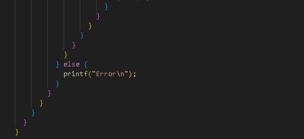

# MODFS CODING CONVENTION
A custom coding convention for most relevant languages designed for maximum readability, performance and safety.

## Formatting

1. Namings in the source code should be based on the standard library namings for the used programming language.

```C#
class CSharpClass {
    void CSharpMethod() {}
}
```
```Java
class JavaClass {
    void javaMethod() {}
}
```
```C++
class cpp_class {
    void cpp_method() {}
}
```

2. Identation is always 4 spaces, tabs should never be used

```C++
int get_extension(const char *path, char *buff, int max_size) {
    int size = strlen(path),
        index = 0;
    for (int i = 0; i < size; i++)
        if (path[i] == '.' && i != size - 1) 
            index = i + 1;
        else if (path[i] == '/' || path[i] == '\\')
            index = 0; 
    if (index && max_size >= size-index) {
        strncpy(buff, &path[index], size-index);
        buff[size-index] = '\0';
    }
    return index>0;
}
```

3. If the loop/condition block is 1 line don't use braces.

```C++

if (cond) { // <--- BAD
    action;
}

if (cond) //   <--- GOOD
    action;
while (cond)
    action;
for (int i=0; i<10;i++)
    action;
```

4. The braces should be always at the same line. This involves class, method, loop, branch and all other definitions. This allows the code to be compact (take less screen height) and readable as much as possible

```C++
class foo {
int foo () {
if (foo) {
while (foo) {
```

5. There should be 1 line break between methods definitions but only for the ones which are > 1 line in height. Same for fields

```C++
void foo() {
    // Body
}

void bar() { 
    // Body
}

void foo() { }
void bar() { }
int foo;
int bar;
```

6. Line breaks should be only used when needed to mark logical code blocks

```C++
struct info;           // Initialize user
info.name = "Ivan";
info.surname = "Ivanov";

struct server;         // Initialize server
server.address = "127.0.0.1";
server.port = 8080;

if (connect(server)) { // Connect & send data
    printf("Connected to server\n");
    server.send(info);
    server.disconnect();
}
```

7. The code should be as compact as possible but still remain clean & readable.

## Implementation

1. Never use recursion (replace with loops if needed) to avoid stack overflow & control flow errors.

```C++

int factorial(int n) {       // <--- BAD 
    if (n == 0) return 1;
    else return n * factorial(n - 1);
}

int factorial(int n) {       // <--- GOOD
    int result = 1;
    for (int i = 1; i <= n; i++)
        result *= i;
    return result;
}
```

2. All loops should have fixed bounds to prevent soft-locking the program.

```C++
while (1)                     // <--- BAD
while (1 && i < MAX_ITER)     // <--- GOOD
```

3. Heap usage should be avoided as much as possible. No dynamic allocations (eg. malloc & free)

```C++
header* parse_header(char *data) {          // <--- BAD
    header* result = (header*)malloc(sizeof(header));
    // fill up result
    return result;
}

int parse_header(char *data, header *ptr) { // <--- GOOD
    int status;
    // fill up header ptr by ref
    return status;
}
```

4. Avoid embeding multiple expressions (if/for/while etc.) inside each other, use **break**, **continue**, **return** instead.

```C++
void itarate_modules(module* ptr) { // <--- BAD
    while (*ptr) {
        if (ptr->is_native || ptr->has_data) {
            method* mtd_list = module->methods;
            while (*method) {
                if (method->is_public || method->is_static) {
                    // Process method
                }
                method++;
            }
        }
        ptr++;
    }
}

void itarate_modules(module *ptr) { // <--- GOOD
    while (*ptr) {
        if (!ptr->is_native || !ptr->has_data)
            continue;
        method* mtd_list = module->methods;
        while (*method) {
            if (!method->is_public || !method->is_static)
                continue;
            // Process method
            method++;
        }
        ptr++;
    }
}
```

<div align=center>
    <br/>
    <text>This is what might happen if this rule isn't followed</text>
</div>
<br/>

## Class Rules

1. Private members should have a **_** suffix.

```C++
class shape {
private:
    int height_;
    int width_;
};
```

2. Always explicitly specify the visibility of class members.

```C++
class shape { // <--- BAD
    int height_;
    int width_;
};

class shape { // <--- GOOD
private:
    int height_;
    int width_;
};
```

3. Prefer seperating variable and method declarations by visibility sections.

```C++
class shape {
public:
    int height;
    int width;

public:
    void draw() { }
    void resize() { }
}
```

4. Private section should be at the end of the class.

```C++
class shape {
public:
    int height;
    int width;

private:
    void draw() { }
    void resize() { }
};
```

5. Separate between visibility sections for readability.

```C++
class shape { // <--- BAD
public:
    int height;
    int width;
private:
    void draw() { }
    void resize() { }
};

class shape { // <--- GOOD
public:
    int height;
    int width;

private:
    void draw() { }
    void resize() { }
};
```

6. Avoid using inheritance when unnecessary.
